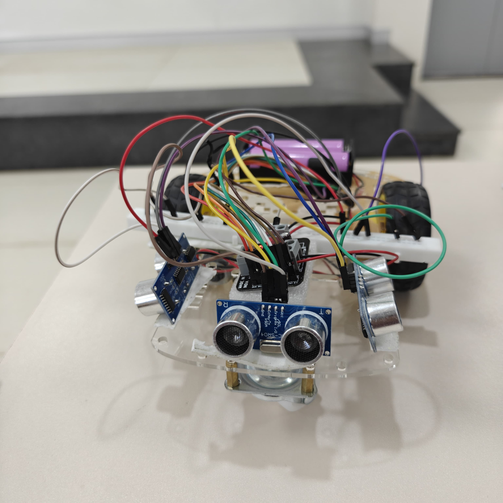
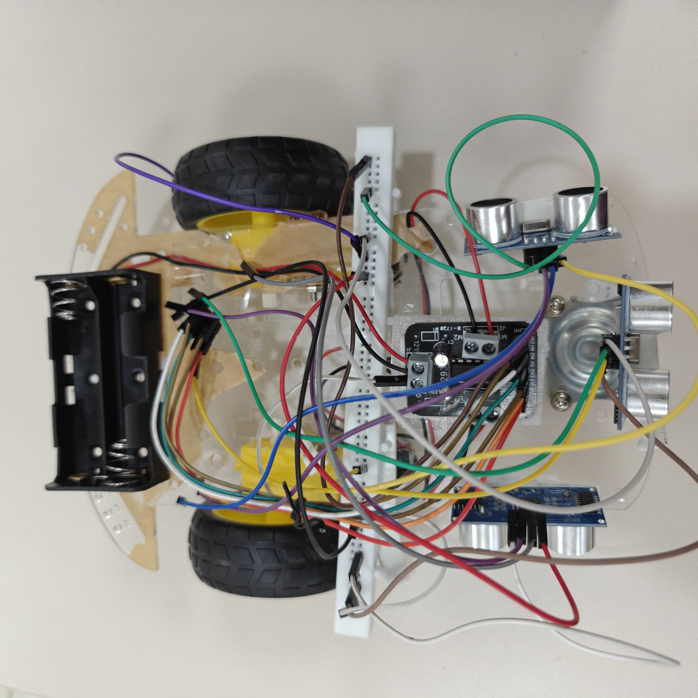

# Maze Solving Bot

A smart bot built using the L298N motor driver, three ultrasonic sensors, and a Proportional (P) controller to navigate and solve mazes autonomously.

---

## Features

- Autonomous maze navigation
- Ultrasonic sensing in three directions (front, left, right)
- Proportional control-based wall following
- Real-time decision making based on obstacle distances
- Precise 90° turning at maze corners
- Modular and extendable codebase for PID control

---

## Hardware Used

| Component           | Description                          |
|--------------------|--------------------------------------|
| L298N Motor Driver | Dual H-Bridge driver for DC motors    |
| Ultrasonic Sensors | HC-SR04 x3 (Front, Left, Right)       |
| Microcontroller     | ESP32                                |
| Dual Motors         | Left and right wheel drive           |
| Power Supply        | 7.4V Li-ion battery or equivalent     |

---

## Wiring Overview

**Motors:**
- Left Motor: IN1 (GPIO 27), IN2 (GPIO 26), EN (GPIO 14)
- Right Motor: IN1 (GPIO 33), IN2 (GPIO 32), EN (GPIO 25)

**Ultrasonic Sensors:**
- Front Sensor: TRIG (GPIO 19), ECHO (GPIO 18)
- Left Sensor: TRIG (GPIO 5), ECHO (GPIO 4)
- Right Sensor: TRIG (GPIO 23), ECHO (GPIO 22)

---

## How It Works

### Initialization
- The setup function configures all motor and sensor pins.
- Serial communication is enabled for monitoring sensor readings.

### Obstacle Detection
- The front ultrasonic sensor continuously checks for walls.
- If an obstacle is detected within a predefined threshold:
  - The bot stops and checks left and right distances.
  - It then turns towards the direction with more space.

### Forward Movement
- If the front is clear, the bot moves forward.
- Optionally, the bot can use a proportional controller (P-controller) for more stable wall following using left and right sensors.

### Proportional Control (Optional)
- Uses the error between left and right wall distances.
- Applies a correction factor to adjust motor speeds.
- Designed to keep the bot centered between walls.

---

## Movement Functions

| Function        | Description                          |
|----------------|--------------------------------------|
| moveForward     | Drives both motors forward           |
| stopMotors      | Stops both motors                    |
| turnLeft        | Turns the bot 90 degrees left        |
| turnRight       | Turns the bot 90 degrees right       |
| readDistance    | Reads distance using a sensor pair   |

---

## Future Enhancements

- Full PID-based wall following for better stability
- Dynamic speed control based on proximity
- Dead-end detection and reverse navigation
- Maze mapping with coordinates and solving algorithms
- Integration of search algorithms like DFS or BFS

---

## Gallery

---

## Built With

- Arduino IDE or PlatformIO
- C++ for ESP32
- Open-source sensor libraries and motor control logic

---

## License

This project is licensed under the MIT License.
